# OAuth Callback Sequence Diagram

Luồng mới không đưa `accessToken` lên URL. Backend chỉ set
`refreshToken` bằng httpOnly cookie, sau đó client tự gọi refresh để lấy
`accessToken`.

Open the full-page version for easier viewing: [oauth-flow.html](./oauth-flow.html)

## Sequence Diagram

```mermaid
sequenceDiagram
    autonumber
    actor User as Nguoi dung
    participant Client as Finsight Client
    participant Backend as Finsight Backend
    participant Auth0 as Auth0
    participant DB as Database

    rect rgb(45, 45, 45)
    note over User,Auth0: Bat dau OAuth
    User->>Client: Bam dang nhap bang Google/GitHub
    Client->>Backend: GET /api/v1/auth/oauth/:provider
    Backend->>Backend: Tao oauth_csrf token
    Backend-->>Client: Set-Cookie: oauth_csrf
    Backend-->>Client: 302 redirect den Auth0 authorize URL
    Client->>Auth0: Mo trang dang nhap Auth0
    User->>Auth0: Dang nhap / chap thuan
    Auth0-->>Backend: GET /api/v1/auth/callback?code=...&state=...
    end

    rect rgb(45, 45, 45)
    note over Backend,DB: Xu ly callback tren Backend
    Backend->>Backend: Giai ma state va validate oauth_csrf
    Backend->>Auth0: POST /oauth/token voi authorization code
    Auth0-->>Backend: Auth0 access_token
    Backend->>Auth0: GET /userinfo
    Auth0-->>Backend: Ho so nguoi dung
    Backend->>DB: Tim hoac tao user
    DB-->>Backend: User
    Backend->>Backend: Tao accessToken va refreshToken
    Backend-->>Client: Set-Cookie: refreshToken (httpOnly)
    Backend-->>Client: 302 /oauth-callback
    note right of Client: Khong co accessToken tren URL
    end

    rect rgb(45, 45, 45)
    note over Client,Backend: Dong bo phien dang nhap tren Client
    Client->>Backend: POST /api/v1/auth/refresh-token
    note right of Client: Trinh duyet tu gui refreshToken cookie
    Backend->>Backend: Verify refreshToken
    Backend-->>Client: 200 { accessToken, expiresAt }
    Client->>Backend: GET /api/v1/users/me
    note right of Client: Authorization: Bearer accessToken
    Backend-->>Client: 200 current user
    Client->>Client: Luu accessToken + user vao Redux
    Client-->>User: Dieu huong vao Dashboard
    end
```



## Token Placement

```text
refreshToken
  - Nam trong httpOnly cookie do backend set
  - JavaScript phia client khong doc truc tiep duoc
  - Duoc browser tu gui khi goi /auth/refresh-token

accessToken
  - Chi tra ve trong JSON cua /auth/refresh-token
  - Luu trong Redux memory state
  - Khong nam trong OAuth redirect URL
```

## Old vs New

```text
Old:
  Backend -> /oauth-callback?accessToken=...&expiresAt=...
  Risk -> token co the lo qua history, log, screenshot, referrer.

New:
  Backend -> /oauth-callback
  Client -> /auth/refresh-token bang httpOnly refresh cookie
  Benefit -> accessToken khong lo tren URL.
```
