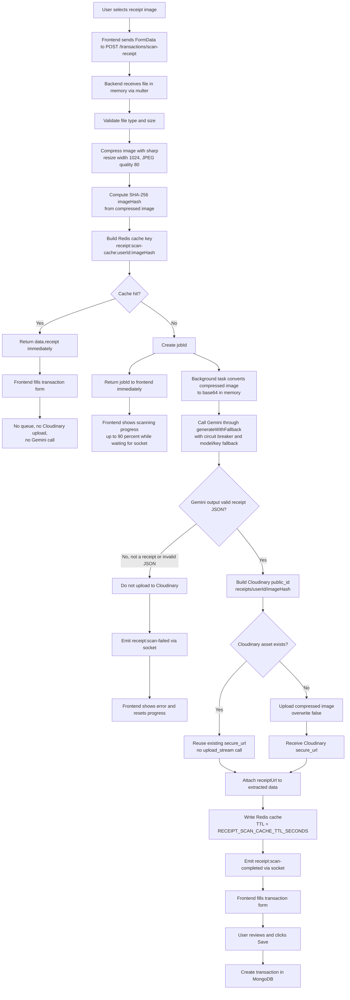

# Receipt scan flow

## Key points

- Redis cache stores only extracted receipt JSON and `receiptUrl`, not image bytes.
- New scans no longer put image bytes into BullMQ.
- The worker still supports older queued jobs that may have `fileBuffer` or `imageUrl`.
- Cache is scoped by `userId + imageHash`, so scan results are not shared across users.
- Non-receipt images fail fast through `receipt:scan-failed` instead of waiting through all retries.
- Gemini invalid JSON is treated as `NonReceiptImageError`, not as an unknown server failure.
- Non-receipt images are not uploaded to Cloudinary.
- Receipt images use deterministic Cloudinary `public_id`, so a repeated image reuses the old `secure_url` instead of uploading or overwriting.
- `RECEIPT_SCAN_CACHE_TTL_SECONDS` must be a positive integer; invalid values fall back to `86400`.
- Legacy worker retries keep `imageHash` after job data is compacted, so cache reuse still works after upload succeeds.
